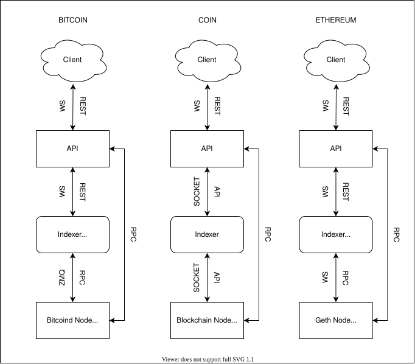
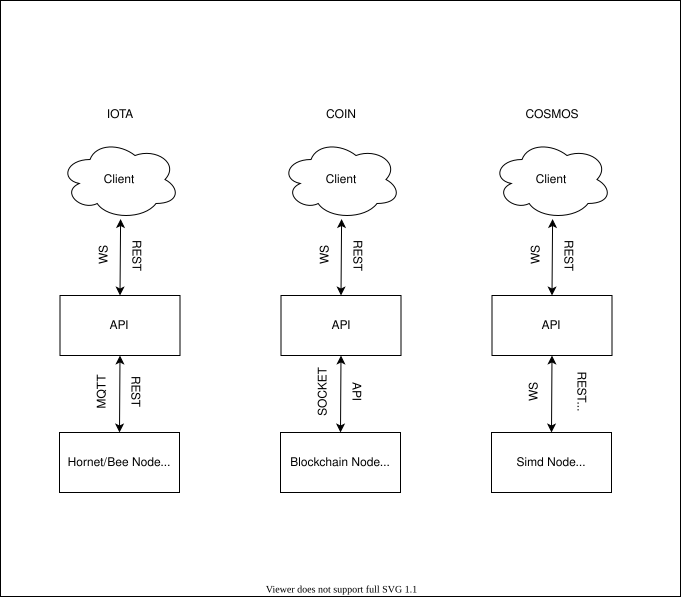

# Pchained

Pchained is an independent project based on ShapeShift Unchained and adapted
for PistachioSwap and other self-hosted blockchain applications. It preserves
the upstream Unchained runtime interfaces used by compatible applications while
keeping project-specific setup and attribution explicit.

Pchained provides a multi-blockchain backend interface with three main goals:
1. Provide a common interface to multiple blockchains
2. Provide additional information not always accessible from the node directly
3. Provide realtime updates about blockchain transactions (pending and confirmed)

## Table Of Contents

- [Pchained](#pchained)
- [Table Of Contents](#table-of-contents)
- [Origin and attribution](#origin-and-attribution)
- [Purpose](#purpose)
- [Helpful Docs](#helpful-docs)
- [Coin Stack Components](#coin-stack-components)
- [Architecture Diagrams](#architecture-diagrams)
- [Deployment](#deployment)
- [Local Networking](#local-networking)
- [Setup](#setup)
- [Docker-Compose Local Dev Instructions](#docker-compose-local-dev-instructions)
    - [Prerequisites](#prerequisites)
    - [Running](#running)
- [Common Issues](#common-issues)

## Origin and attribution

Pchained is an independent project based on ShapeShift Unchained and adapted
for PistachioSwap and other self-hosted blockchain applications.

Pchained is not operated, maintained, sponsored, or endorsed by ShapeShift.

Original project:
https://github.com/shapeshift/unchained

Pchained is distributed under the MIT License. The original ShapeShift
copyright and license notice are preserved in LICENSE.

Pchained modifications copyright (c) 2026 parsij.

PistachioSwap is a separate application. It is not included under Pchained's
license merely because it uses Pchained's API.

## Purpose

Pchained provides self-hosted blockchain indexing and read-only wallet-data
services. It is designed to be usable independently by PistachioSwap and
other applications through documented APIs.

## Helpful Docs

- [Railway](https://docs.railway.com/)
- [OpenAPI](https://github.com/OAI/OpenAPI-Specification)

## Coin Stack Components

- **Node** - coin specific node daemon providing historical blockchain data (ex. bitcoind, geth, etc)
- **Indexer** - optional service that indexes transaction and balance history by address, or any other applicable information, if not provided by the node directly
- **[API](https://api.ethereum.shapeshift.com/docs/)** - provides a base set of functionality via REST and WebSocket that can be extended with coin specific logic

## Architecture Diagrams

With Indexer | No Indexer
:---------:|:------------:
 | 

## Deployment

Coinstacks are deployed to [Railway](https://railway.com/). Each coinstack API has a `railway.json` config in its `api/` directory that defines the build and deploy settings. Railway auto-deploys from the repository on push.

## Notes

- The ethereum coinstack is used in all examples. If you wish to run a different coinstack, just replace `ethereum` with the coinstack name you wish to run
- All paths are relative to the root unchained project directory (ex. `unchained/[go|node]/{path}`)

## Local Networking 

We use traefik as a reverse-proxy to expose all of our docker containers. Traefik is exposed at port `80`. Traefik Dashboard is exposed at port `8080`

Traefik routes requests based on host name. which includes the coinstack name. For Example:
- `api.ethereum.localhost`

## Setup

- Each language subdirectory has setup requirements before running a coinstack locally
  - [Go](go/README.md#initialsetup) - `unchained/go`
  - [Node](node/README.md) - `unchained/node`
- Both `go` and `node` module have linter installed in git pre-commit hook. To set up the hook:
  ```sh
  yarn
  ```

## Docker-Compose Local Dev Instructions

#### Prerequisites

- Install [docker-compose](https://docs.docker.com/compose/install/)

#### Running

- Install node dependencies

  ```sh
  yarn
  ```

- Start the reverse proxy and any common service (ex. hot reloading):

  ```sh
  docker-compose up -d
  ```

  _Note: `-d` runs the containers in daemon (background) mode. If you want to see logs, `-d` can be omitted._

- Start a coinstack:

  ```sh
  cd node/coinstacks/ethereum
  cp sample.env .env // make sure to populate the .env file with valid API keys if required
  docker-compose up
  ```

- Visit http://api.ethereum.localhost/docs to view the OpenAPI documentation for the API

- Tear down a coinstack (including docker volumes):

  ```sh
  cd node/coinstacks/ethereum && docker-compose down
  ```

## Common Issues

- If you are running [Docker Desktop](https://docs.docker.com/desktop/) and see any `SIGKILL` errors, increase your resource limits in the Resources Tab.
  
- Mac OS: when running one of the go coinstacks via `docker-compose` on, you might encounter an issue with the service failing to start indefinitely. This is due to Mac OS network security blocking the service from starting. To work around that issue, run the coinstack directly from CLI:

  ```sh
  cd go && go run cmd/cosmos/main.go -env=cmd/cosmos/.env
  ```

  This will trigger the security popup, allow the go process to make the network calls. Once you approve it, you can kill the process and restart `docker-compose`. The app should start immediately. 


- Mac OS: once you start a coinstack you should be able to access unchained in the browser without further config, but for CLI access to work you need to modify `/etc/hosts` and add a valid DNS entry:

  ```sh
  127.0.0.1 localhost api.cosmos.localhost // add a new alias for the coinstack
  ```
